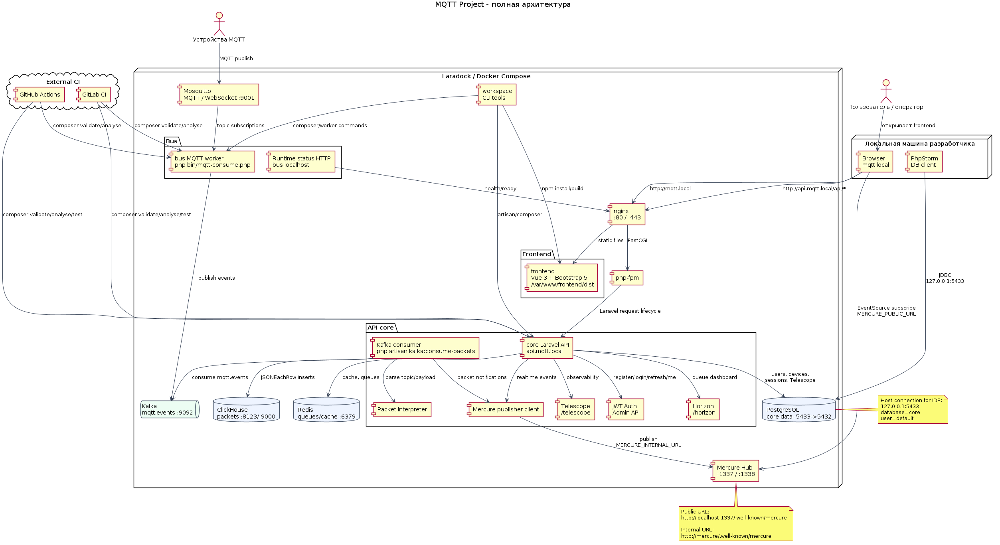

# Архитектура стенда



Исходник диаграммы: [architecture.puml](architecture.puml).

```text
Devices -> Mosquitto cluster(s) -> bus instance(s) -> Kafka -> core -> ClickHouse
                                                              |
                                                              -> PostgreSQL: users, devices, app data
```

- `bus` - PHP CLI worker, который подписывается на MQTT topics в Mosquitto и
  публикует события в Kafka topic `mqtt.events`.
- Интеграционных шин может быть несколько: по одной на группу MQTT topics,
  tenant/site, домен нагрузки или отдельный Mosquitto-кластер. Все экземпляры
  используют одинаковый Kafka-контракт: key - исходный MQTT topic, value -
  исходный MQTT payload.
- Перед Kafka в `bus` используется Redis Streams outbox. MQTT-пакет сначала
  записывается в Redis через `XADD`, краткосрочная дедупликация делается через
  `SET ... NX EX`, а Kafka-публикация подтверждается `XACK` только после
  успешного `flush`.
- `core` - Laravel-приложение: HTTP API, пользователи, устройства,
  интерпретация MQTT-пакетов и запись пакетных данных в ClickHouse.
- `frontend` - Vue 3 + Bootstrap 5 интерфейс, обслуживается nginx на
  `mqtt.local`.
- `laradock` - локальная Docker-инфраструктура проекта.
- `Mercure` - realtime hub для публикации событий из API и подписок frontend.
- `Redis` - cache и queue backend для Laravel/Horizon.

Диаграмма описывает стендовую runtime-архитектуру. Docker/Laradock, PhpStorm,
workspace-команды и CI-связи намеренно не показаны, потому что они относятся к
локальной разработке или delivery pipeline, а не к работе стенда.

Текущая PHP-среда работает на PHP 8.5. Phalcon не используется: `bus` является
CLI worker-сервисом, а не веб-приложением.

Правила сохранения архитектуры описаны в
[RFC: сохранение архитектуры](rfc-architecture.md).

PNG-версия диаграммы генерируется из PlantUML-исходника:

```bash
plantuml -tpng -o assets docs/architecture.puml
```
